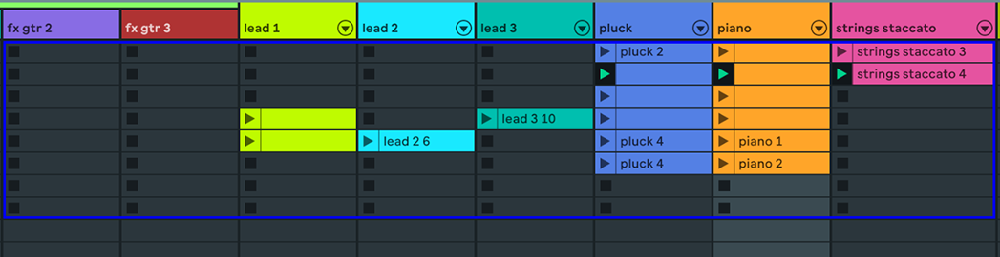

# Using the zcx session ring

Like other control surface scripts, zcx provides a 'session ring' — a colored box that can be moved around the session to target different tracks or scenes.




!!! note "Session view"

    This lesson deals only with the session ring itself.
    To configure the session view (as seen on Launchpad and similar), see the [session view](session-view.md) lesson.

## Resizing the ring

By default, the session ring will be configured to the same width and height as your controller's matrix.
You may resize the session ring via the [preferences.yaml](../reference/file/preferences.md#session_ring) option `session_ring`.

```yaml title="preferences.yaml"
session_ring:
  width: 8
  height: 8
```

## Disabling the ring

You may disable the ring by [setting](#resizing-the-ring) one or both of `width` and `height` to `0`.

## Moving the ring

A script's ring may be positioned with the [ring command](../reference/command.md#ring) or the ClyphX Pro [ring actions](https://www.cxpman.com/action-reference/control-surface-actions/#cs-n-ring-tx-sy).

zcx scripts are compatible with ClyphX Pro's [script linking feature](https://www.cxpman.com/manual/core-concepts/#script-linking).

## ClyphX Pro control surface actions

ClyphX Pro includes a variety of [control surface actions](https://www.cxpman.com/action-reference/control-surface-actions/), which can be used to interact with control surfaces. Many of these actions are compatible with zcx scripts.

## Referencing the ring from template strings

You can use the built in `ring` variable within template expressions to perform actions on tracks or scenes at a certain position within the ring.

`ring` has two attributes: `tracks` and `scenes`. We can index into either and retrieve the name of the track at that position of the ring, or the **zero-indexed** scene number at that position of the ring.

### Dynamic scene controls

```yaml
__scene_controls:
  includes: [
    scene_1, scene_2, scene_3, scene_4, scene_5, scene_6, scene_7, scene_8
  ]
  gestures:
    pressed: >
      SCENE ${ring.scenes[me.group_index] + 1}
```

Looking at [the above screenshot](#using-the-zcx-session-ring), if `scene_1` was pressed the action list `SCENE 1` would be executed, launching scene one.

If we [move the ring](#moving-the-ring) down two scenes, pressing `scene_1` would trigger the action list `SCENE 3`. `scene_2` would do `SCENE 4`.

### Dynamic track controls
```yaml
__state_controls:
  includes: [
    state_1, state_2, state_3, state_4, state_5, state_6, state_7, state_8
  ]
  gestures:
    pressed: >
       "${ring.tracks[me.group_index]}" / MUTE
```

Looking at [the above screenshot](#using-the-zcx-session-ring), if `state_1` was pressed, the action list `"fx gtr 2" / MUTE` would be executed.

### Dynamic encoder mappings

It is possible to map encoders to the parameter of a track at a certain position of the ring.
See [Encoder Reference](../reference/encoder.md#targeting-the-session-ring) for details.

### Out of bounds references

It is often valid to refer to tracks or scenes outside of the session ring by using a negative index, or an index that is greater than or equal to the width and height of the ring. For example:

- Using `"${ring.tracks[-1]}" / MUTE` will mute the track one to the left of the left edge of the ring.
- Using `"${ring.tracks[8]}" / MUTE` on a 8-track ring will mute the track one to the right of the right edge of the ring.
- Using `"SCENE ${ring.scenes[-8]}"` while the top edge of the ring is at scene 9 will launch scene 1.

## Additional configuration options

Set these options in [preferences.yaml](#resizing-the-ring).

### drag_by_highlight

```yaml title="preferences.yaml" hl_lines="4"
session_ring:
  width: 8
  height: 8
  drag_by_highlight: true
```

_Default is_ `true`.

`drag_by_highlight: true`

With this setting enabled, when the selected clip slot **was** inside the ring, and then moves to the outside edge of the ring (one to the left, one below, etc.), the ring will move itself so that the selected slot is back inside the ring.

`drag_by_highlight: always`

When the selected clip slot is outside the ring, zcx will **always** move the ring so that the selected slot is back inside the ring.

`drag_by_highlight: pinned`

The selected clip slot will always be in the top-left of the ring.

`drag_by_highlight: false`

None of these behaviours.

!!! warning
    When using zcx as part of [ClyphX Pro Script Linking](https://www.cxpman.com/manual/core-concepts/#script-linking), avoid setting `drag_by_highlight` to `always` or `pinned`.

